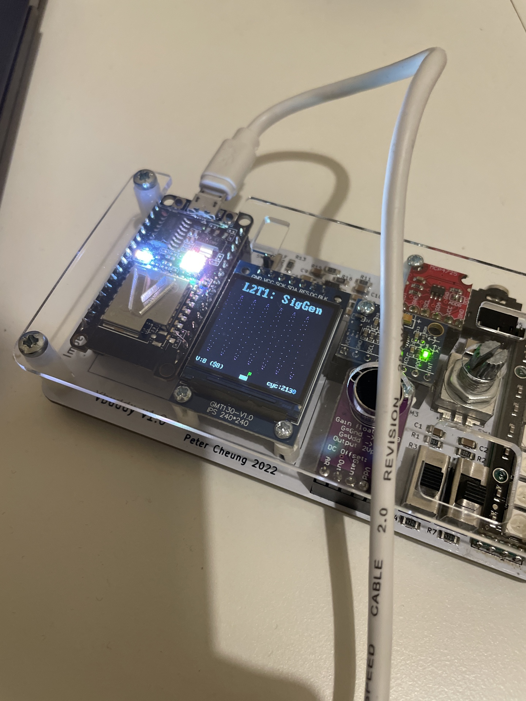
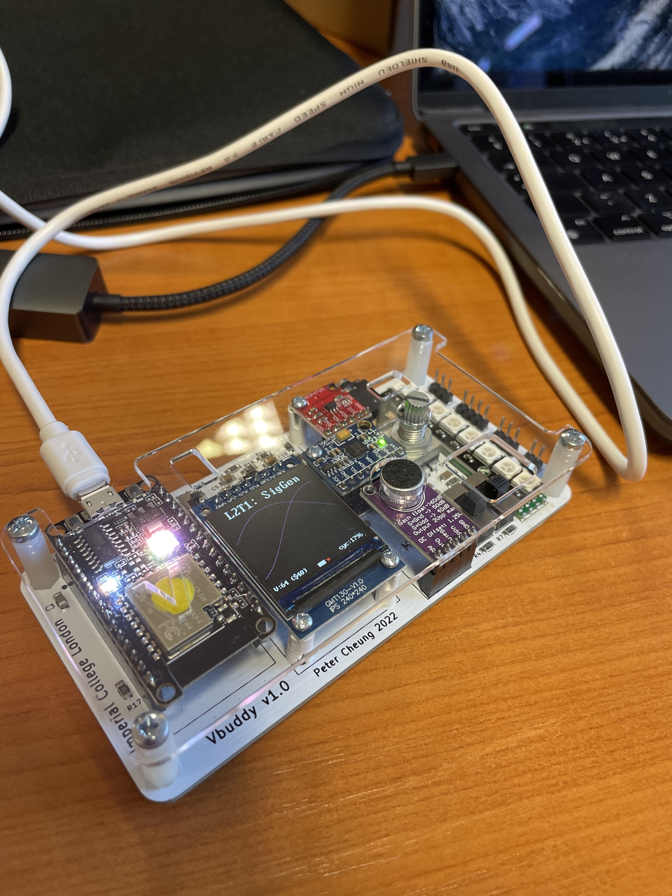

# Lab 2 Logbook

---
## Task 1 - Simple sinewave generator
---

**Step 1 - Specifying a 256 x 8 bit ROM**


<p align="center">  </p>


The first step was to create the ROM.  I created rom.sv in the task one folder.


**Step 2 - Create the sinegen module**

This requires you to create a "top-level" module **_sinegen.sv_**, which includes two components: **_counter.sv_** and **_rom.sv_** as shown below.

<p align="center">  </p>

I created the toplevel module and instantiated instances of the counter and rom modules.  Using wires, I was able to create the same system as the diagram illustrates.  I recieved errors while creating this code and this was because I needed to include the files as my computer was not automatically doing this.  An example is shown below.

```python
`include "task1/rom.sv"

`include "task1/counter.sv"
```

**Step 3 - Create the testbench for sinegen**

Based on what you learned from Lab 1, try to write the testbench **_sinegen_tb.cpp_** on your own. You should initially set incr[7:0] to 1.  Then use the **_vbdPlot()_** function to plot output data sample to Vbuddy.

I tried to modify last weeks testbench in order to create this weeks one but I struggled so I used the appendix to assist me in this.  However, I am now a bit more confident with understanding the testbench

<p align="center">  </p>

I was able to get the sinewave to correctly display on the VBuddy and also the early break using the Q key on the keyboard worked as expected.

I then tried to adjust the frequency using the rotary control on VBuddy.  This worked but my method of increasing the count made the display not look continuous.

<p align="center">  </p>


---
## Task 2 - Sine and Cosine Dual wave generation 
---

I firstly modified the counter to remove the increment feature as it was not needed at this stage.  I then created the dual input ROM which takes two inputs:  The input from the counter as well as the offset input.  It uses these two inputs to output two values at rom.

The next step was to modify the testbench to read the offset value as the vbdValue.

While testing, I found that everything worked as expected and an image can be seen below.

<p align="center">  </p>


---
## Task 3 - Capture and display audio signal in RAM
---

The goal of Task 3 is to capture real audio signal using the microphone/amplifier module on Vbuddy.  These samples are written to a dual-port RAM stored in successive locations.  At the same time, read back from  the RAM the store signal at a different address offset from the write address.  In this way, the retrieved signal is a delayed version of the original signal.